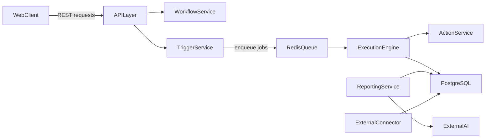

# FlowPilot Architecture

FlowPilot uses a service-oriented architecture (SOA) in a single repository for easier team collaboration.

## Service Responsibilities

- **WebClient (`frontend/`)**: React UI for workflow builder, execution dashboard, and reporting views.
- **APILayer (`backend/app/api/`)**: FastAPI request entry point, auth and request validation boundary.
- **WorkflowService (`backend/app/workflow/`)**: lifecycle operations for workflow definitions.
- **TriggerService (`backend/app/trigger/`)**: trigger registration and schedule/event evaluation.
- **ExecutionEngine (`backend/app/execution/`)**: Celery-driven asynchronous workflow orchestration.
- **ActionService (`backend/app/action/`)**: isolated action execution contracts and action registry.
- **ReportingService (`backend/app/reporting/`)**: monthly report generation and AI summary orchestration.
- **PersistenceLayer**: PostgreSQL for workflows, logs, reports, and synchronized external data.

## Runtime Flow

## Infrastructure

- `infra/docker-compose.yml` starts local dependencies (PostgreSQL, Redis) and app services.
- `infra/postgres/init.sql` is reserved for initial SQL bootstrap.

## Current Implementation Status

| Service | Implementation | Notes |
|---|---|---|
| APILayer | `app/api/router.py`, `app/trigger/webhook_router.py`, `app/reporting/router.py`, `app/user/router.py` | Bearer-token auth via `app/core/auth.py` is optional on most endpoints and required only where scoping matters. |
| WorkflowService | `app/workflow/service.py`, `app/workflow/workflow.py`, `app/workflow/validator.py` | Builder pattern for `WorkflowDefinition`; validation runs on create, update, and manual runs. |
| TriggerService | `app/trigger/*.py` + `app/trigger/scheduler.py` | Supports time (one-off + recurring via cron/weekly/daily/etc) and webhook triggers. |
| ExecutionEngine | `app/execution/engine.py`, `app/execution/tasks.py` | Celery tasks pull runs off Redis, iterate steps, resolve `{{ template }}` context, record per-step logs in `workflow_step_runs`. |
| ActionService | `app/action/*.py` + `app/action/actionRegistry.py` | Registered actions: `http_request`, `send_email`, `calendar_create_event` (calendar currently returns a mock event). |
| ReportingService | `app/reporting/service.py`, `app/reporting/router.py` | Aggregates monthly run stats; exposes a seam for an AI summary. |
| PersistenceLayer | `app/db/schema/*.py` | Tables: users, user_sessions, user_triggers, user_actions, workflows, workflow_triggers, workflow_steps, workflow_runs, workflow_step_runs. |
| WebClient | `frontend/src/pages/*.tsx` | Auth, workflow list with Run + run history, workflow builder. |

## Execution Lifecycle

1. A run is enqueued via manual click (`POST /api/workflows/{id}/run`), Celery
   Beat (`execution.tick_time_triggers`, every 60 s), or a webhook
   (`/hooks/{path}`).
2. `execution.run_workflow` dequeues the run id, loads the workflow, and marks
   the run `RUNNING`.
3. For each step in `step_order`, the engine builds `inputs` by substituting
   `{{context.path}}` templates, dispatches to the action via
   `ActionRegistry`, and records a `WorkflowStepRun` row.
4. Each step's output is merged into the context so later steps can reference
   it (`{{previous.status_code}}`, `{{steps.my_step.body}}`, etc.).
5. On completion the run is marked `SUCCESS` (storing the last output) or
   `FAILED` (storing the error message).
