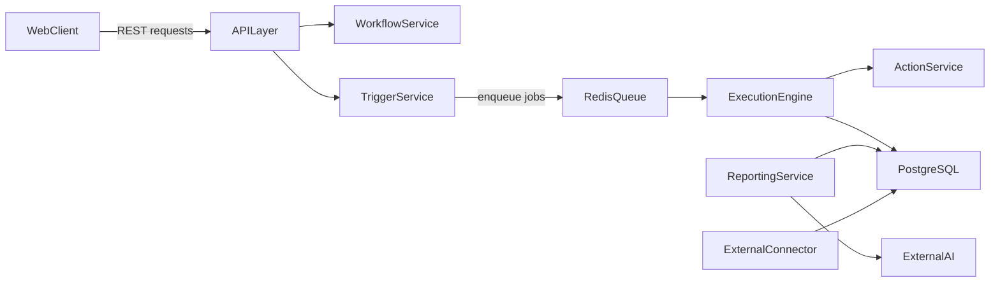

# FlowPilot Architecture

FlowPilot uses a service-oriented architecture (SOA) in a single repository for easier team collaboration.

## Service Responsibilities

- **WebClient (`frontend/`)**: React UI for workflow builder, execution dashboard, and reporting views.
- **APILayer (`backend/app/api/`)**: FastAPI request entry point, auth and request validation boundary.
- **WorkflowService (`backend/app/workflow/`)**: lifecycle operations for workflow definitions.
- **TriggerService (`backend/app/trigger/`)**: trigger registration and schedule/event evaluation.
- **ExecutionEngine (`backend/app/execution/`)**: Celery-driven asynchronous workflow orchestration.
- **ActionService (`backend/app/action/`)**: isolated action execution contracts and action registry.
- **ReportingService (`backend/app/reporting/`)**: monthly report generation and AI summary orchestration.
- **ExternalConnector (`backend/app/connectors/`)**: sync adapters for external platforms (for example Google Calendar).
- **PersistenceLayer**: PostgreSQL for workflows, logs, reports, and synchronized external data.

## Runtime Flow

## Infrastructure

- `infra/docker-compose.yml` starts local dependencies (PostgreSQL, Redis) and app services.
- `infra/postgres/init.sql` is reserved for initial SQL bootstrap.
